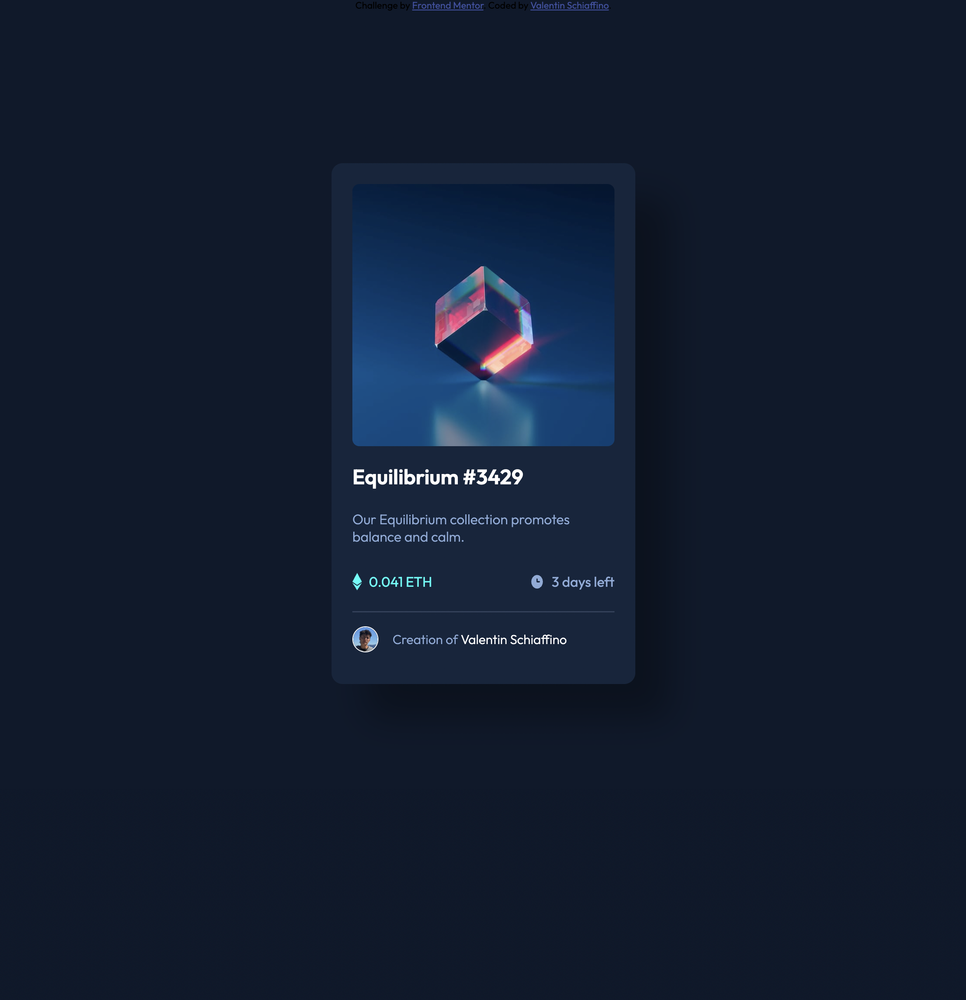

# Wellcome! 👋

This is a solution to the [NFT preview card component challenge on Frontend Mentor](https://www.frontendmentor.io/challenges/nft-preview-card-component-SbdUL_w0U). Frontend Mentor challenges help you improve your coding skills by building realistic projects. 

## Table of contents

- [Overview](#overview)
  - [The challenge](#the-challenge)
  - [Screenshot](#screenshot)
  - [Links](#links)
- [My process](#my-process)
  - [Built with](#built-with)
  - [What I learned](#what-i-learned)
- [Author](#author)

## Overview

### The challenge

Users should be able to:

- View the optimal layout depending on their device's screen size
- See hover states for interactive elements

### Screenshot

Challenge:


My solution 🤠:


### Links

- Live Site URL: [Add live site URL here](https://valenss.github.io/nft-preview-card-component-main/)

## My process

### Built with

- Semantic HTML5 markup
- CSS custom properties
- Flexbox

### What I learned

In this project I learn the importance about declare CSS variables, and reuse them all along the code.

```css
/* VARIABLES */
:root{
    /* Colors */
    --primariy-Soft-Blue: hsl(215, 51%, 70%);
    --primariy-Cyan: hsl(178, 100%, 50%);

    --Neutral-main-BG: hsl(217, 54%, 11%);
    --Neutral-card-BG: hsl(216, 50%, 16%);
    --Neutral-line: hsl(215, 32%, 27%);
    --White: hsl(0, 0%, 100%);

    /* Font size */
    --body-font-size: 18px;
    
    /* Font weight */
    --light-font-weight: 300;
    --medium-font-weight: 400;
    --bold-font-weight: 600;

    /* Margenes */
    --mb-0-5: .5rem;
    --mb-1: 1rem;
    --mb-1-5: 1.5rem;
    --mb-2: 2rem;
}
```

## Author

- Linkedin - [Valentin Schiaffino](https://www.linkedin.com/in/valentin-schiaffino/)
- Frontend Mentor - [@Valenss](https://www.frontendmentor.io/profile/Valenss)
- Gmail - [Valentin Schiaffino](mailto:valentinschiaffino2@gmail.com)
